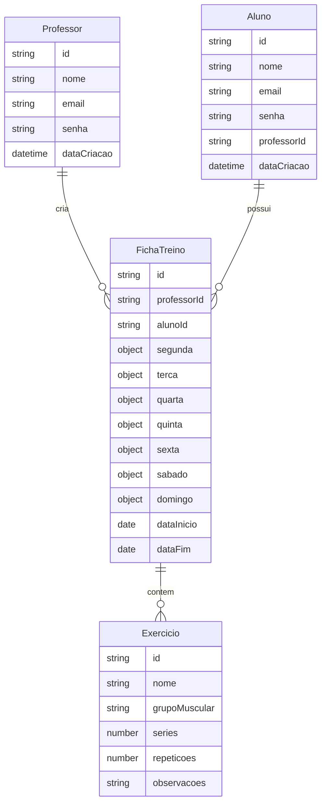

# Sistema de Gerenciamento de Fichas de Treino

## 📋 Visão Geral
Sistema backend desenvolvido em Node.js com Express e MongoDB para gerenciamento de fichas de treino de academia. O sistema permite que professores criem e gerenciem fichas de treino para seus alunos, definindo exercícios específicos para cada dia da semana.

## 🏗️ Arquitetura

### Entidades Principais



## 💾 Estrutura de Dados (MongoDB)

### Schema Professor
```javascript
{
  nome: String,
  email: String,
  senha: String,
  dataCriacao: Date
}
```

### Schema Aluno
```javascript
{
  nome: String,
  email: String,
  senha: String,
  professorId: ObjectId,
  dataCriacao: Date
}
```

### Schema FichaTreino
```javascript
{
  professorId: ObjectId,
  alunoId: ObjectId,
  dataInicio: Date,
  dataFim: Date,
  segunda: [{
    exercicioId: ObjectId,
    series: Number,
    repeticoes: Number,
    observacoes: String
  }],
  terca: [{...}],
  quarta: [{...}],
  quinta: [{...}],
  sexta: [{...}],
  sabado: [{...}],
  domingo: [{...}]
}
```

### Schema Exercicio
```javascript
{
  nome: String,
  grupoMuscular: String,
  series: Number,
  repeticoes: Number,
  observacoes: String
}
```

## 📁 Estrutura de Diretórios
```
src/
├── config/
│   ├── database.js
│   └── auth.js
├── models/
│   ├── Professor.js
│   ├── Aluno.js
│   ├── FichaTreino.js
│   └── Exercicio.js
├── controllers/
│   ├── ProfessorController.js
│   ├── AlunoController.js
│   ├── FichaTreinoController.js
│   └── ExercicioController.js
├── middlewares/
│   ├── auth.js
│   └── validation.js
├── routes/
│   ├── professor.routes.js
│   ├── aluno.routes.js
│   └── ficha.routes.js
└── app.js
```

## 🔗 API Endpoints

### Autenticação
- **POST /api/auth/login** - Autenticação de usuários
- **POST /api/auth/register** - Registro de novos usuários

### Professores
- **GET /api/professores** - Lista todos os professores
- **POST /api/professores** - Cria novo professor
- **GET /api/professores/:id** - Obtém detalhes de um professor
- **PUT /api/professores/:id** - Atualiza dados do professor
- **DELETE /api/professores/:id** - Remove um professor

### Alunos
- **GET /api/alunos** - Lista todos os alunos
- **POST /api/alunos** - Cria novo aluno
- **GET /api/alunos/:id** - Obtém detalhes de um aluno
- **PUT /api/alunos/:id** - Atualiza dados do aluno
- **DELETE /api/alunos/:id** - Remove um aluno

### Fichas de Treino
- **GET /api/fichas** - Lista todas as fichas
- **POST /api/fichas** - Cria nova ficha
- **GET /api/fichas/:id** - Obtém detalhes de uma ficha
- **PUT /api/fichas/:id** - Atualiza uma ficha
- **DELETE /api/fichas/:id** - Remove uma ficha

### Exercícios
- **GET /api/exercicios** - Lista todos os exercícios
- **POST /api/exercicios** - Cria novo exercício
- **GET /api/exercicios/:id** - Obtém detalhes de um exercício
- **PUT /api/exercicios/:id** - Atualiza um exercício
- **DELETE /api/exercicios/:id** - Remove um exercício

## 👥 Funcionalidades por Perfil

### Professor
- Autenticação no sistema
- CRUD de fichas de treino
- Associação de fichas a alunos
- Gerenciamento de exercícios

### Aluno
- Autenticação no sistema
- Visualização de suas fichas de treino
- Acompanhamento dos treinos diários

## 🔒 Segurança

### Autenticação
- Implementação de JWT (JSON Web Tokens)
- Senhas criptografadas com bcrypt
- Middleware de autenticação para rotas protegidas

## 🛠️ Tecnologias Utilizadas

- **Node.js** - Ambiente de execução
- **Express** - Framework web
- **MongoDB** - Banco de dados
- **JWT** - Autenticação
- **bcrypt** - Criptografia de senhas
- **mongoose** - ODM para MongoDB

## 📦 Dependências Principais

```json
{
  "dependencies": {
    "express": "^4.17.1",
    "mongoose": "^6.0.0",
    "jsonwebtoken": "^8.5.1",
    "bcryptjs": "^2.4.3",
    "cors": "^2.8.5",
    "dotenv": "^10.0.0"
  }
}
```

## ⚙️ Variáveis de Ambiente

```env
PORT=3000
MONGODB_URI=mongodb://localhost:27017/fit-plan
JWT_SECRET=seu_jwt_secret
JWT_EXPIRES_IN=1d