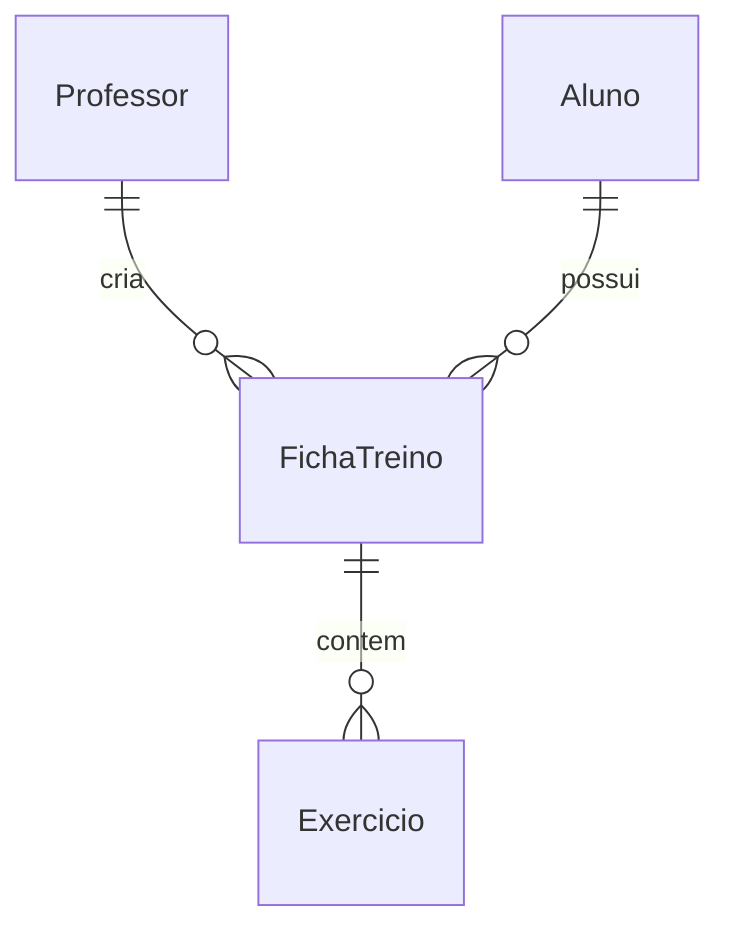

# 📊 Documentação MongoDB - Fit Plan

## 📋 Estrutura das Collections

### Collection: professors
```json
{
  "_id": "ObjectId('507f1f77bcf86cd799439011')",
  "nome": "João Silva",
  "email": "joao.silva@email.com",
  "senha": "hash_da_senha",
  "dataCriacao": "2024-05-20T00:00:00.000Z"
}
```

### Collection: alunos
```json
{
  "_id": "ObjectId('507f1f77bcf86cd799439012')",
  "nome": "Maria Oliveira",
  "email": "maria.oliveira@email.com",
  "senha": "hash_da_senha",
  "professorId": "ObjectId('507f1f77bcf86cd799439011')",
  "dataCriacao": "2024-05-20T00:00:00.000Z"
}
```

### Collection: exercicios
```json
{
  "_id": "ObjectId('507f1f77bcf86cd799439013')",
  "nome": "Supino Reto",
  "grupoMuscular": "Peitoral",
  "series": 4,
  "repeticoes": 12,
  "observacoes": "Manter cotovelos alinhados durante o movimento"
}
```

### Collection: fichasTreino
```json
{
  "_id": "ObjectId('507f1f77bcf86cd799439014')",
  "professorId": "ObjectId('507f1f77bcf86cd799439011')",
  "alunoId": "ObjectId('507f1f77bcf86cd799439012')",
  "dataInicio": "2024-05-20T00:00:00.000Z",
  "dataFim": "2024-06-20T00:00:00.000Z",
  "segunda": [
    {
      "exercicioId": "ObjectId('507f1f77bcf86cd799439013')",
      "series": 4,
      "repeticoes": 12,
      "observacoes": "Aumentar carga gradualmente"
    }
  ],
  "terca": [],
  "quarta": [],
  "quinta": [],
  "sexta": [],
  "sabado": [],
  "domingo": []
}
```

## 🔄 Relacionamentos



## 📝 Detalhamento dos Campos

### Professor
- `_id`: Identificador único
- `nome`: Nome completo do professor
- `email`: Email para login (único)
- `senha`: Senha criptografada
- `dataCriacao`: Data de registro no sistema

### Aluno
- `_id`: Identificador único
- `nome`: Nome completo do aluno
- `email`: Email para login (único)
- `senha`: Senha criptografada
- `professorId`: Referência ao professor responsável
- `dataCriacao`: Data de registro no sistema

### Exercicio
- `_id`: Identificador único
- `nome`: Nome do exercício
- `grupoMuscular`: Grupo muscular trabalhado
- `series`: Número de séries padrão
- `repeticoes`: Número de repetições padrão
- `observacoes`: Instruções adicionais

### FichaTreino
- `_id`: Identificador único
- `professorId`: Professor que criou a ficha
- `alunoId`: Aluno designado
- `dataInicio`: Data de início do programa
- `dataFim`: Data de término do programa
- `segunda` até `domingo`: Arrays de exercícios para cada dia

## 🗄️ Criação das Collections

### 1. Criar o Banco de Dados
```javascript
use fit-plan
```

### 2. Collection Professors
```javascript
db.createCollection("professors")
db.professors.createIndex({ "email": 1 }, { unique: true })
```

### 3. Collection Alunos
```javascript
db.createCollection("alunos")
db.alunos.createIndex({ "email": 1 }, { unique: true })
```

### 4. Collection Exercícios
```javascript
db.createCollection("exercicios")
```

### 5. Collection Fichas de Treino
```javascript
db.createCollection("fichasTreino")